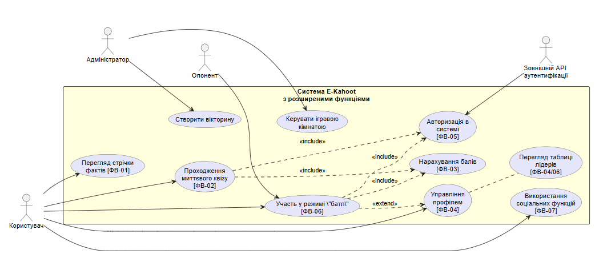
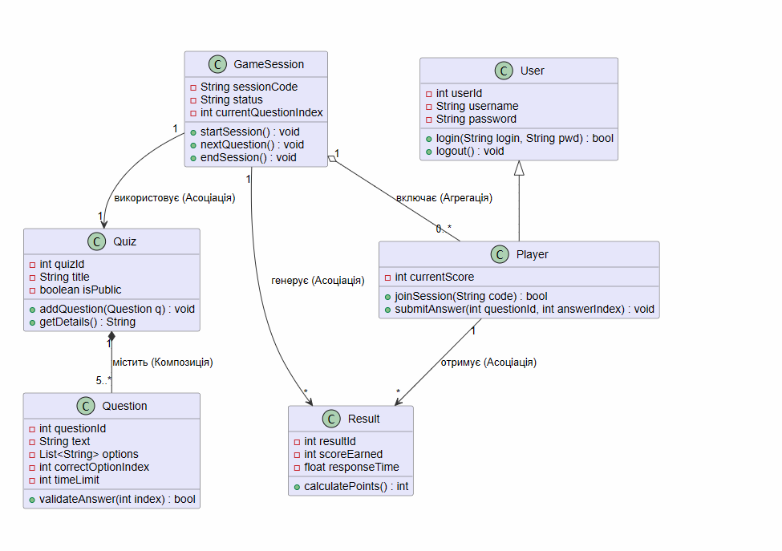
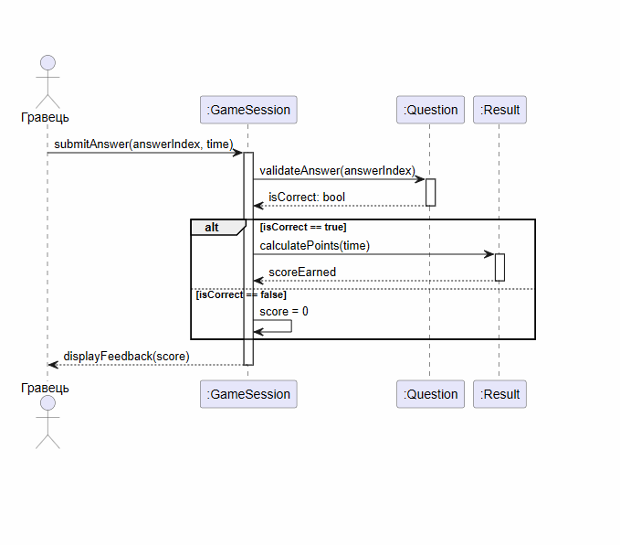

# E-Kahoot — Платформа для інтелектуальних змагань

## Опис проєкту

Labaratory work 2, made by Andreienkov Mykyta, PZPI-25-1 **E-Kahoot** — це програмна система для проведення швидких інтелектуальних змагань у реальному часі. Основна мета системи — надати користувачам можливість створювати вікторини та змагатися з друзями за допомогою ігрових кімнат і динамічних таблиць лідерів.

## 1. Функціональні вимоги (FR)

Повний список вимог доступний у файлі: [requirements.md](requirements.md).

| ID | Опис вимоги |
|---|---|
| FR-01 | Створення власних вікторин із питаннями та відповідями. |
| FR-02 | Створення ігрових кімнат за унікальним кодом. |
| FR-03 | Підтримка режиму реального часу для надсилання відповідей. |
| FR-04 | Автоматичний розрахунок балів (правильність + швидкість). |
| FR-05 | Відображення динамічної таблиці лідерів. |
| FR-06 | Автентифікація користувачів (логін/пароль). |

## 2. UML Моделювання системи

Усі діаграми побудовані з використанням нотації UML 2.5.

### 2.1 Діаграма прецедентів (Use Case Diagram)

Відображає взаємодію Користувача, Опонента та Адміністратора з функціями системи.

### 2.2 Діаграма класів (Class Diagram)

Статична структура системи, що містить класи User, Quiz, GameSession та інші, із зазначенням атрибутів, методів та зв'язків.

### 2.3 Діаграма послідовності (Sequence Diagram)

Динаміка сценарію «Відправка відповіді та нарахування балів» (FR-04).

### 2.4 Матриця трасовності (Traceability Matrix)

У таблиці нижче наведено зв'язок між початковими функціональними вимогами та елементами проектування (прецедентами, класами та динамічними сценаріями), що підтверджує повне покриття вимог архітектурою системи.

| ID вимоги | Прецедент (Use Case) | Задіяні класи | Діаграма послідовності |
|---|---|---|---|
| **FR-01** | UC-01 (Перегляд стрічки фактів) | User | — |
| **FR-02** | UC-02 (Проходження миттєвого квізу) | Player, GameSession, Quiz, Question | — |
| **FR-03** | UC-03 (Нарахування балів) | Player, Result, GameSession | SD-01 (Відправка відповіді та нарахування балів) |
| **FR-04** | UC-04 (Управління профілем), Перегляд таблиці лідерів | User, Player, Result | SD-01 (фрагмент нарахування) |
| **FR-05** | UC-05 (Авторизація в системі) | User | — |
| **FR-06** | UC-06 (Участь у режимі "батл") | Player, GameSession, Result | — |
| **FR-07** | UC-07 (Використання соціальних функцій) | User, Player | — |
